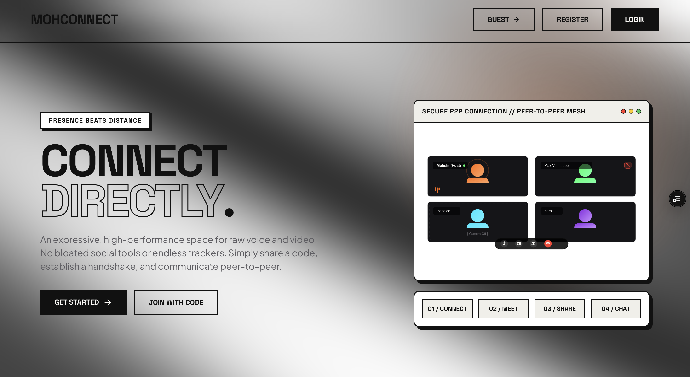
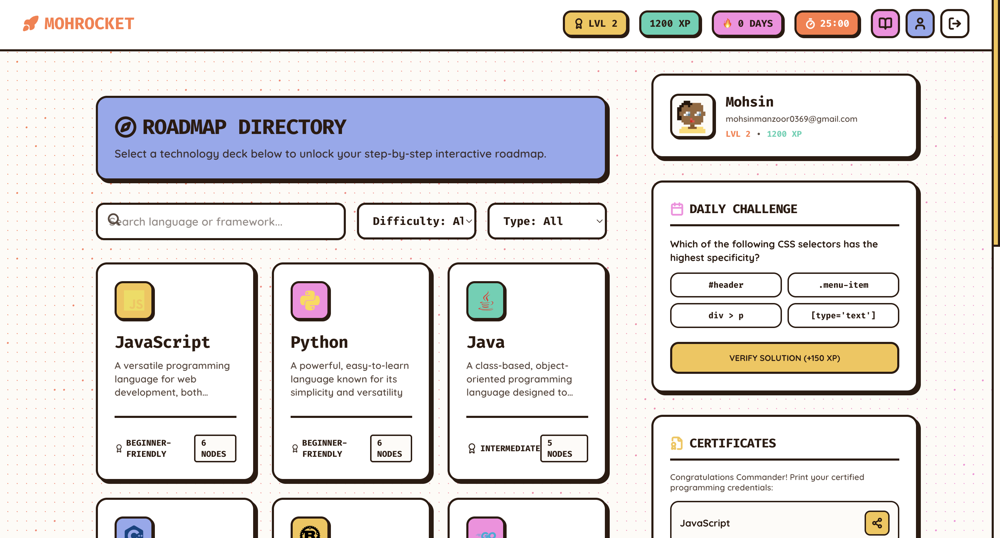
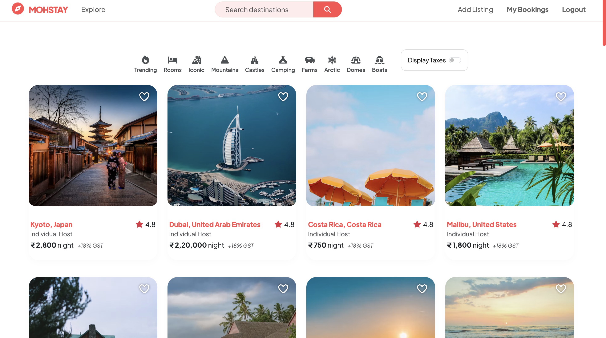

<div align="center">


</div>

<br>


<br><br>

<a href="https://github.com/Mohsin-369">

</a>

<a href="https://github.com/Mohsin-369">

</a>

<a href="mailto:mohsinmanzoor0369@gmail.com">

</a>

<a href="https://www.linkedin.com/in/mohsinmanzoor-">

</a>

</div>

---

<div align="center">

# 👨🏻‍💻 About Me

*"Building software that is simple, scalable and meaningful."*

</div>

<table>

<tr>

<td width="60%" valign="top">

## 👋 Hi, I'm Mohsin

I'm a **Computer Science student** and a **Full-Stack MERN Developer** from **India 🇮🇳** who enjoys turning ideas into polished web applications.

Rather than just learning technologies, I enjoy understanding **how real products are designed, built and deployed**.

### 🚀 What I'm doing

- 🌱 Learning **DevOps & Cloud Computing**
- 💻 Building full-stack applications with MERN
- 📚 Improving Data Structures & Algorithms
- ⚡ Exploring System Design
- 🤝 Contributing to Open Source

### 💡 What I enjoy

- ✨ Building real-world products
- 📷 Photography
- 🎨 Clean UI & UX
- 🚀 Startup ideas
- ☕ Late-night coding sessions

</td>

<td width="40%" align="center">


<br><br>


<br>


<br>


</td>

</tr>

</table>

---
<div align="center">

## 👨🏻‍💻 Current Focus

</div>

<table align="center">

<tr>

<td align="center" width="25%">

### 🚀

### Building

Production Ready

Web Applications

</td>

<td align="center" width="25%">

### ☁️

### Learning

Docker

AWS

Kubernetes

</td>

<td align="center" width="25%">

### 📚

### Practicing

DSA

System Design

Backend

</td>

<td align="center" width="25%">

### 🔥

### Exploring

Open Source

Scalable Systems

Automation

</td>

</tr>

</table>

<br>

<div align="center">


</div>

---

<div align="center">

# 🚀 Featured Projects

*Crafting modern, scalable, and user-focused web applications.*

</div>

<br>

<table>
<tr>
<td width="50%" valign="top">

## 🎥 MohConnect

A modern peer-to-peer video conferencing platform built with **WebRTC**, **Socket.IO**, and the **MERN Stack**.

### ✨ Features

- 🔐 Secure Authentication
- 📹 HD Video Calls
- 💬 Real-time Chat
- 🖥 Screen Sharing
- 👥 Meeting Rooms

<br>

### ⚙ Tech Stack


<br><br>

<a href="https://mohconnect.vercel.app">

</a>

<a href="https://github.com/Mohsin-369/MohConnect">

</a>

</td>

<td width="50%" align="center">



</td>

</tr>
</table>

---

<table>
<tr>

<td width="50%" align="center">



</td>

<td width="50%" valign="top">

## 🚀 MohRocket

A gamified developer productivity platform that combines learning, roadmaps, challenges, and progress tracking in one experience.

### ✨ Features

- 🗺 Interactive Roadmaps
- 🎯 Daily Challenges
- 🏆 XP & Levels
- 📜 Certificates
- 📚 Learning Dashboard

<br>

### ⚙ Tech Stack


<br><br>

<a href="https://mohrocket.vercel.app">

</a>

<a href="https://github.com/Mohsin-369/MohRocket">

</a>

</td>

</tr>
</table>

---

<table>
<tr>

<td width="50%" valign="top">

## 📸 Lost Lens

A modern photography portfolio showcasing landscapes, travel, and nature through an immersive gallery experience.

### ✨ Features

- 🖼 Gallery
- ✨ Smooth Animations
- 📧 Contact Form
- 📱 Responsive Design
- 🌍 Photography Showcase

<br>

### ⚙ Tech Stack


<br><br>

<a href="https://lostlens.netlify.app">

</a>

<a href="https://github.com/Mohsin-369/Lost-Lens">

</a>

</td>

<td width="50%" align="center">


</td>

</tr>
</table>

---

<table>
<tr>

<td width="50%" align="center">



</td>

<td width="50%" valign="top">

## 🏨 MohStay

An Airbnb-inspired hotel booking platform featuring secure authentication, reviews, image uploads, and interactive maps.

### ✨ Features

- 🏡 Property Listings
- ⭐ Reviews & Ratings
- 📍 Mapbox Integration
- ☁ Cloudinary Uploads
- 🔐 User Authentication

<br>

### ⚙ Tech Stack


<br><br>

<a href="https://mohstay.onrender.com">

</a>

<a href="https://github.com/Mohsin-369/YOUR_REPO">

</a>

</td>

</tr>
</table>

---

<div align="center">

### ❤️ Frontend


</div>

---

<div align="center">

### ⚙️ Backend


</div>

---

<div align="center">

### 🗄️ Database


</div>

---

<div align="center">

### ☁️ DevOps & Cloud


</div>

---

<div align="center">

### 🧰 Tools


</div>

<br>

<div align="center">

# 🌱 Developer Journey

</div>

<br>

```text
2023
Started Programming
        │
        ▼
2024
Learned Java & Web Development
        │
        ▼
2025
Built Full Stack MERN Projects
        │
        ▼
2026
Learning DevOps • Cloud • System Design
        │
        ▼
Future 🚀
Software Engineer building products used by millions
```

---

<div align="center">

# 🎯 What I'm Focused On

</div>

<table>

<tr>

<td align="center" width="25%">

### 🚀

Building

Full Stack

Applications

</td>

<td align="center" width="25%">

### ☁️

Learning

AWS

Docker

Kubernetes

</td>

<td align="center" width="25%">

### 🧠

Improving

DSA

Backend

System Design

</td>

<td align="center" width="25%">

### 🌍

Contributing

Open Source

Real Products

Community

</td>

</tr>

</table>

---

<div align="center">

# ☕ Beyond Coding

</div>

<br>

<div align="center">

| 📸 Photography | 🌙 Night Owl | ☕ Coffee | 🎧 Music | 🚀 Startups |
|:--------------:|:-----------:|:--------:|:--------:|:-----------:|

</div>

---

<div align="center">

# 💭 A Quote I Believe In

> *"Programs must be written for people to read, and only incidentally for machines to execute."*  
> **— Harold Abelson**

</div>

---

<div align="center">


</div>

<div align="center">

# 🐍 Contribution Snake

*Consistency is built one commit at a time.*

<br>


</div>

---

<div align="center">

# 🌐 Let's Connect

<br>

<a href="https://github.com/Mohsin-369">

</a>

<a href="https://www.linkedin.com/in/mohsinmanzoor-">

</a>

<a href="https://x.com/Mohsin_0369">

</a>

<a href="https://instagram.com/mohsin____012">

</a>

<a href="mailto:mohsinmanzoor0369@gmail.com">

</a>

</div>

---

<div align="center">

# 🤝 Open to Collaborate

✨ Open Source

💼 Internship Opportunities

🚀 Full Stack Projects

☁️ DevOps & Cloud

💡 Startup Ideas

</div>

---

<div align="center">

# ❤️ Thanks for Visiting


<br><br>

> ### *"Code with curiosity. Build with purpose."*

</div>

---

<div align="center">


</div>

<!--

███╗   ███╗ ██████╗ ██╗  ██╗███████╗██╗███╗   ██╗
████╗ ████║██╔═══██╗██║  ██║██╔════╝██║████╗  ██║
██╔████╔██║██║   ██║███████║███████╗██║██╔██╗ ██║
██║╚██╔╝██║██║   ██║██╔══██║╚════██║██║██║╚██╗██║
██║ ╚═╝ ██║╚██████╔╝██║  ██║███████║██║██║ ╚████║
╚═╝     ╚═╝ ╚═════╝ ╚═╝  ╚═╝╚══════╝╚═╝╚═╝  ╚═══╝

Made with ❤️ by Mohsin Manzoor

-->
